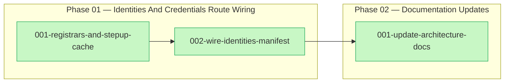
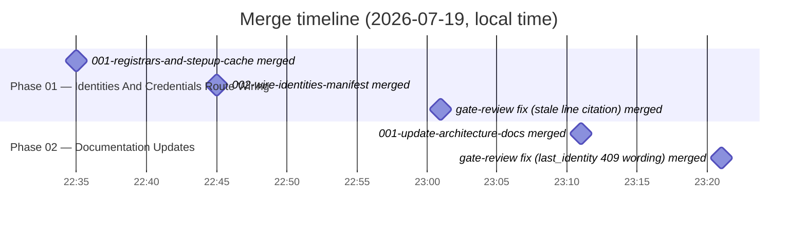

# Identities & Credentials Manifest Wiring — Summary

## Purpose and scope

mod-users ships a complete identity/credential self-service HTTP surface —
list OIDC identities, start-link / unlink an OIDC identity, set / remove a
local password, and the step-up (request / verify) challenge — but it was
wired only into the hand-written, non-generated reference dev server
(`api/cmd/server/main.go`). None of it appeared in `moduleforge.module.yaml`,
so the `mfgen` codegen path never emitted these routes into any generated
host app, producing a `404` on every generated app for the entire surface and
making step-up-gated credential changes permanently unreachable (the
token-minting verify endpoint was itself unreachable).

This plan closed that gap by wiring the surface into
`moduleforge.module.yaml`, strictly mirroring the precedent set by the
completed `self-route-manifest` plan for `GET`/`PUT /v1/self`: the read-only
List endpoint stays reachable to accounts with an unverified email
(`requireOIDCConfirmed` + `requireAuth`), while the six credential-mutating
endpoints additionally require a verified email
(`+ requireVerifiedEmail`), expressed as two per-`middleware:` route entries
rather than a single `expr:`-based route. Every `constructor:`/`register:`
symbol the new manifest entries reference was re-exported through the public
facades in the same task that added the manifest entries — the mandatory
guard against the `self-route-manifest` incident (2026-07-15), where a
manifest-only addition compiled in `mod-users` but broke every consuming
app's `mfgen` output. Scope was confined to the `mod-users` tree: no changes
to `mfgen` itself and no changes to consuming apps beyond what they pick up
by regenerating from the updated manifest.

Two phases carried this out: **Phase 01 — Identities And Credentials Route
Wiring** added the internal registrars and the public step-up cache
constructor, then wired both into the manifest, the public facades, and the
reconciled reference server; **Phase 02 — Documentation Updates** brought
`docs/architecture.md` and `docs/mod-users-spec.md` into line with the
shipped surface. Both phases are complete; all three tasks landed on the
plan branch, along with two gate-review fix commits addressing issues
correctness lenses raised after each phase.

## What was done

### Phase 01 — Identities And Credentials Route Wiring

- [001-registrars-and-stepup-cache.md](./phase-01-route-wiring/001-registrars-and-stepup-cache.md)
  — Added `RegisterSelfIdentitiesReadRoute` (mounting `GET /self/identities`)
  and `RegisterSelfIdentitiesWriteRoutes` (mounting the six
  credential-mutating endpoints) in `api/internal/handlers/`, mirroring
  `self_routes.go`'s per-verb-registrar convention, plus the public
  `auth.NewStepUpConsumedCache(ctx)` constructor in `api/auth/auth.go` that
  builds the consumed-JTI `*sync.Map` and starts `StartStepUpJanitor` as a
  construction side effect. Pure groundwork — no `moduleforge.module.yaml`,
  facade, or `main.go` changes — covered by a non-tautological
  read/write-split test and three cache/janitor tests.
- [002-wire-identities-manifest.md](./phase-01-route-wiring/002-wire-identities-manifest.md)
  — Wired `identitiesHandler` and `stepUpConsumed` into
  `moduleforge.module.yaml` as two `provides.services` entries plus two
  `provides.routes` entries (read vs. mutating, differentiated purely by
  `middleware:`), following the `/v1/self` two-entry convention. Added the
  matching public-facade re-exports in `api/handlers/handlers.go`
  (`IdentitiesHandler` alias, `NewIdentitiesHandler` constructor taking the
  exported `authhandlers.Sender` interface, and the two registrar wrapper
  functions), reconciled `api/cmd/server/main.go` to move `GET
  /self/identities` out of the verified-email-only group, and added a
  facade call-shape test guarding against the self-route-manifest incident.

### Phase 02 — Documentation Updates

- [001-update-architecture-docs.md](./phase-02-doc-updates/001-update-architecture-docs.md)
  — Documented the identity/credential surface Phase 1 wired into the
  manifest: `docs/architecture.md` gained an Identities/Credentials
  API-layer table row plus a paragraph on the two-entry route split and the
  `stepUpConsumed` constructor-starts-janitor model; `docs/mod-users-spec.md`
  gained a new use case, an API-definition block, and a security-requirements
  bullet. Every claim was verified against the actual manifest/source rather
  than taken from the task doc's excerpts alone, and a genuine
  pre-existing gap was flagged rather than silently expanded into scope:
  `api/openapi.yaml` does not document this surface at all.

## Diagrams

<!-- For AI agents and non-visual readers: a left-to-right dependency graph
     with one subgraph per phase. Phase 01 has two tasks in a hard sequential
     dependency (002 references symbols 001 adds); its second task feeds
     Phase 02's single task, which depends on both Phase 01 tasks having
     landed. All three task nodes are marked done. -->

<!-- For AI agents and non-visual readers: a gantt-style timeline of the five
     merge-worthy commits on the plan branch, all landing on 2026-07-19
     (local time), ordered earliest to latest: Phase 01's two task merges
     (22:35, 22:45), a gate-review fix correcting a stale main.go line-number
     citation (23:01), Phase 02's task merge (23:11), and a second
     gate-review fix scoping the last_identity 409 wording (23:21). The two
     gate-review fixes are plan-branch commits, not task-record merges, and
     are included here for a complete picture of the branch's history. -->

## Git landmarks

| Task | Branch | Commit | Merge |
|------|--------|--------|-------|
| [001-registrars-and-stepup-cache.md](./phase-01-route-wiring/001-registrars-and-stepup-cache.md) | `phase-01-task-01-registrars-and-stepup-cache` | `a54e67c` | `519bf1e2c72dcbc579ebc8cbfca9105fe97405b4` |
| [002-wire-identities-manifest.md](./phase-01-route-wiring/002-wire-identities-manifest.md) | `phase-01-task-02-wire-identities-manifest` | `8756de1` | `8881f4b07415fd27f08b48f6ad0511b6b27e2f7c` |
| [001-update-architecture-docs.md](./phase-02-doc-updates/001-update-architecture-docs.md) | `phase-02-task-01-update-architecture-docs` | `1a2ca37` | `c27d650bfdcf4808ab9b31ce3e2e4a75facaaf30` |

All three task records carried complete branch/commit/merge hashes, and every
hash above resolves against the plan worktree's history (`git rev-parse`).

Beyond the three task merges, two gate-review fix commits landed directly on
the plan branch (not tied to a task record, so they have no row above):

- `54c548f` — merge of `2026-07-19-fix-stale-line-citation` (2026-07-19
  23:01:42), correcting a stale `main.go` line-number citation flagged by the
  phase-01 correctness lens. This is also the recorded `diff_base` for
  Phase 02 in the plan's task tracking.
- `c87f9fb` — merge of `2026-07-19-fix-last-identity-409-wording` (2026-07-19
  23:21:13), scoping the `last_identity` 409 wording to unlink/remove-password
  only, per a doc-wording precision issue flagged by the phase-02 correctness
  lens.

Both are confirmed ancestors of the plan branch `HEAD`
(`git merge-base --is-ancestor`).

## Follow-ups

`plan/followups.yaml` in this worktree is a repo-wide log shared across
several prior plans that reused this worktree lineage; most of its entries
belong to unrelated plans (`users-apiresp-migration`, `gui-core-gui-adoption`).
The four entries below are tagged `plan/phase:route-wiring` — this plan's
Phase 01 — and are reproduced with their original wording. No entries tagged
to Phase 02 (`doc-updates`) remain: one was added during that phase and later
removed as superseded. No blocker-type entries were found among them; all four
are follow-up recommendations.

- **go.work workaround documented in follow-up oyo6/building-common.md
  assumes single-level worktree nesting; this task's worktree is
  double-nested (task worktree carved from a plan worktree) and needed
  additional `go work edit -replace` overrides for 6 cross-module deps beyond
  plain `go work use`. Worth a doc update / new follow-up so future
  doubly-nested task worktrees in this repo don't rediscover it.** (`UaNK`)
- **Pre-existing flaky test `TestNewStepUpConsumedCache_JanitorStopsOnCancel`
  (`api/auth/stepup_cache_test.go`, added by task 001, not touched by this
  task) failed once under full-suite load (goroutine-count timing assertion)
  but passed reliably in isolation and on repeat full-suite runs. Worth
  investigating if it recurs; out of this task's scope to fix.** (`5RbD`)
- **go.work workaround for this doubly-nested worktree layout matched task
  001's documented recipe exactly (5 `../` + explicit `-replace` overrides
  with `@v0.0.0` qualifiers), reinforcing that follow-up
  oyo6/building-common.md guidance should account for this nesting depth.**
  (`QKY6`)
- **[phase-01-route-wiring architecture-conformance gate] `api/openapi.yaml`
  (AGENTS.md's designated "authoritative REST API specification") has zero
  hits for identities/credential/step-up — the identity/credential
  self-service surface (list/link/unlink OIDC identities, set/remove
  password, step-up request/verify) now wired into `moduleforge.module.yaml`
  is undocumented there. Pre-existing gap (the endpoints already existed
  hand-wired in `main.go` before this plan), not introduced or worsened by
  phase-01, and explicitly out of this plan's Phase 2 doc-update scope
  (`docs/architecture.md` + `docs/mod-users-spec.md` only). Recommend a
  follow-up task to add these endpoints to `openapi.yaml`.** (`biJk`)
