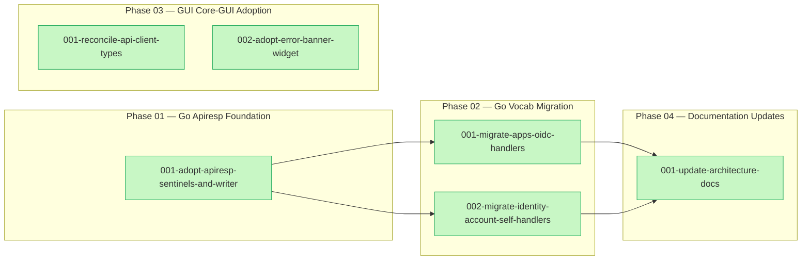
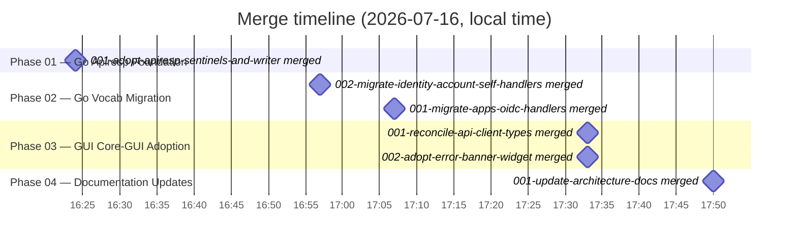

# Users Apiresp Migration — Summary

## Purpose and scope

This plan (`users-apiresp-migration`) is Wave 1 of the multi-phase API response and
error-standardization effort, scoped to the `mod-users` repository only. It migrated `mod-users`' HTTP
`api/` surface and its `gui/` client onto the canonical shared contract defined in
[`docs/mf-standards/architecture/api-response-design.md`](../docs/mf-standards/architecture/api-response-design.md):
promoting the module's local `internal/authz` sentinels onto the shared `apiresp` sentinels so other
modules can `errors.Is` against them, routing error writing through the shared `apiresp.WriteError`
implementation, migrating every ad-hoc top-level `error.code` string literal to the reserved core
vocabulary (moving finer-grained distinctions into namespaced `details[].code`), and reconciling the
`gui/` client types and error widget with the promoted `@moduleforge/core-gui` primitives.

The plan carried a hard precondition: every task depended on Wave 0 (`mod-core`'s
`apiresp-error-widgets` plan, a separately-authored sibling delivering the shared `apiresp` Go package
and the `@moduleforge/core-gui` error/toast toolkit) merging first. Once that dependency cleared, all
four phases — Go foundation, Go vocabulary migration, GUI core-gui adoption, and documentation updates
— ran to completion across six tasks, all merged into the plan branch on 2026-07-16.

A significant scope boundary was deliberately held throughout: five flat-envelope error sites
(`step_up_required`, `last_identity`, `email_unverified`, `oidc_not_confirmed`, and the two
`internal/auth/` sites) were identified during planning as non-conformant but structurally
incompatible with a same-shape migration (one is relied on as a stable string by cross-repo app
consumers), and were explicitly deferred out of this plan's scope rather than silently fixed.

## What was done

### Phase 01 — Go Apiresp Foundation

- [001-adopt-apiresp-sentinels-and-writer.md](./phase-01-go-apiresp-foundation/001-adopt-apiresp-sentinels-and-writer.md)
  — Wired the shared `apiresp` package as the module's single error-classification and
  envelope-construction authority: promoted the `internal/authz` sentinels onto `apiresp`'s canonical
  sentinels, collapsed the three sentinel-classifying handler helpers
  (`writeAuthzError`/`writeServiceError`/`writeCoreServiceErr`) onto `apiresp.WriteError`, and mapped
  `svc.ErrEmailTaken`/`svc.ErrInvalidInput` onto the `conflict`/`invalid_input` wire shapes with
  structured field details.

### Phase 02 — Go Vocab Migration

- [001-migrate-apps-oidc-handlers.md](./phase-02-go-vocab-migration/001-migrate-apps-oidc-handlers.md)
  — Migrated all 15 `bad_request` and 3 `validation_error` literal error-code sites in `apps.go`,
  `oidc_providers.go`, and `oidc_config.go` onto the reserved `invalid_input` vocabulary, adding
  namespaced `users.<rule>` field details where a site distinguished a specific validation rule.
- [002-migrate-identity-account-self-handlers.md](./phase-02-go-vocab-migration/002-migrate-identity-account-self-handlers.md)
  — Migrated the 17 literal error-code sites in `identities.go`, `self.go`, `assume.go`, and
  `user_accounts.go` covering the plan's most nuanced cases — `bad_request`/`validation_error` to
  `invalid_input`, `unauthorized`/`bad_credentials` to `unauthenticated` with field details, and
  `identity_not_found` to a plain `not_found` (a recorded design decision) — while leaving the two
  flat-envelope `step_up_required`/`last_identity` sites untouched per the plan's deferred scope.

### Phase 03 — GUI Core-GUI Adoption

- [001-reconcile-api-client-types.md](./phase-03-gui-core-gui-adoption/001-reconcile-api-client-types.md)
  — Reconciled `gui/src/lib/api.ts`'s wire and client error types with `@moduleforge/core-gui`'s
  canonical `ApiError`/`ApiErrorResponse`/`FieldErrorData`/`ApiRequestError` shapes (replacing the
  local duplicates), populated `details` on thrown errors from the parsed envelope, and renamed the
  synthesized 401 code from `unauthorized` to `unauthenticated` while preserving the existing
  unconditional-throw behavior relied on by the OAuth-return caller.
- [002-adopt-error-banner-widget.md](./phase-03-gui-core-gui-adoption/002-adopt-error-banner-widget.md)
  — Replaced `error-message.tsx`'s direct `Alert`/`AlertDescription`/`AlertCircle` markup with a
  thin delegation to `@moduleforge/core-gui`'s shared `<ErrorBanner>` widget, removing the cross-module
  low-level-primitive coupling while preserving `ErrorMessage`'s existing null/non-null rendering
  contract.

### Phase 04 — Documentation Updates

- [001-update-architecture-docs.md](./phase-04-doc-updates/001-update-architecture-docs.md)
  — Updated `api/openapi.yaml`'s `Error` schema with the reserved 6-code vocabulary and the new
  optional `details` array, and reconciled `docs/architecture.md` and `docs/mod-users-spec.md`'s
  error-contract descriptions to the migrated shape, while flagging a newly-discovered scope gap in
  `api/internal/handlers/auth/*.go` that the new spec doesn't yet cover.

## Diagrams

<!-- For AI agents and non-visual readers: a left-to-right dependency graph with one subgraph per
     phase. Phase 01 (single task) feeds both Phase 02 tasks. The two Phase 02 tasks then both feed
     the single Phase 04 task. Phase 03's two tasks form their own subgraph with no inbound or
     outbound edges to the other phases, reflecting that phase's documented independence from the Go
     work (it depends only on Wave 0, not on Phases 1-2). All six task nodes are marked done. -->

<!-- For AI agents and non-visual readers: a gantt-style timeline of the six task-branch merge
     commits, all landing on 2026-07-16 (local time), ordered earliest to latest: Phase 01's task at
     16:24, Phase 02's task 002 at 16:57 (ahead of task 001, reflecting their parallel-eligible,
     non-sequential dispatch), Phase 02's task 001 at 17:07, Phase 03's two tasks essentially
     simultaneously at 17:33, and Phase 04's task last at 17:50. -->

## Git landmarks

| Task | Branch | Commit | Merge |
|------|--------|--------|-------|
| [001-adopt-apiresp-sentinels-and-writer.md](./phase-01-go-apiresp-foundation/001-adopt-apiresp-sentinels-and-writer.md) | `phase-01-task-01-adopt-apiresp-sentinels-and-wr` | `694f729` | `e50d9b48119f2bd9a21653530e5fc64d2a17cc28` |
| [001-migrate-apps-oidc-handlers.md](./phase-02-go-vocab-migration/001-migrate-apps-oidc-handlers.md) | `phase-02-task-01-migrate-apps-oidc-handlers` | `34fd280` | `de996b6ba0600a29be148e70fe540dc6aba55a33` |
| [002-migrate-identity-account-self-handlers.md](./phase-02-go-vocab-migration/002-migrate-identity-account-self-handlers.md) | `phase-02-task-02-migrate-identity-account-self` | `ea7a469` | `69a68aff8ca83cbfba7a3d0cafd5b7600976f3a8` |
| [001-reconcile-api-client-types.md](./phase-03-gui-core-gui-adoption/001-reconcile-api-client-types.md) | `phase-03-task-01-reconcile-api-client-types` | `3533209` | `f54e84d9e9b67f5bfa6e92d12cf267b10b31bfab` |
| [002-adopt-error-banner-widget.md](./phase-03-gui-core-gui-adoption/002-adopt-error-banner-widget.md) | `phase-03-task-02-adopt-error-banner-widget` | `0a9204e` | `fdc19c49d6853098d8bd66cd931bb262523df59f` |
| [001-update-architecture-docs.md](./phase-04-doc-updates/001-update-architecture-docs.md) | `phase-04-task-01-update-architecture-docs` | `ebc05c4` | `26b1cd0bf4d463b1e8feda718bf56bbb485e8603` |

## Follow-ups

`plan/followups.yaml` in this worktree is a repo-wide log shared across several prior plans that
reused this worktree lineage (its earliest entries, dated 2026-07-03/07-05, belong to unrelated
plans — `gui-build-alignment`, `stale-artifact-cleanup`, `dev-stack-disposition`, `ci-bun-migration`,
`preview-and-readme`, `auth-ui-components`, `forgot-reset-email-code-ui`). The items below are the
ones tagged to this plan's four phases (`go-apiresp-foundation`, `go-vocab-migration`,
`gui-core-gui-adoption`, `doc-updates`), all dated 2026-07-16, reproduced with their original wording.
No `### Blockers` entries were found among them — all remaining open items are follow-up
recommendations, not blockers.

**Phase 01 — Go Apiresp Foundation**

- `make lint.model`'s shadow-db-lint step can't reach its ephemeral Postgres container in this sandbox
  (Docker networking timeout) - an environment limitation, not a `model/` code issue; `model/` is
  untouched by this task.
- Phase-01 boundary review's link-chain check (README-rooted reachability) found several project docs
  not reachable from README.md: `api/server/CLAUDE.md`, `deploy/k8s/README.md`,
  `deploy/local/README.md`, `deploy/serverless/README.md`, `model/README.md`, `next-steps.md`
  (`plan/*.md`, `.flow/binding.md`, and `CLAUDE.md` files under `plan/` are expected exclusions —
  transient plan artifacts / agent-context files, not persistent project documentation). None of these
  orphaned files were touched by phase-01's diff (which only touched `api/*.go`, `plan/TODO.yaml`,
  `plan/followups.yaml`, and the phase-01 task doc), so this predates this plan and is not a
  regression it introduced. No broken links were found otherwise (a python link-checker script; one
  run produced false-positive broken links for `docs/architecture.md` and `docs/mod-users-spec.md`'s
  `./mf-standards/...` links, but a clean re-run confirmed those targets exist and resolve fine).
  Recommend a manager/tech-writer pass to either link these orphans from README.md (if they should be
  part of the discoverable doc graph) or confirm they're intentionally out-of-band (e.g. deploy
  runbooks meant to be found by directory browsing, not README links).
- Phase-01 architecture-conformance review found: `writeServiceError`'s `svc.ErrEmailTaken` branch
  (`api/internal/handlers/user_accounts.go`) bypasses `apiresp.WriteError` and hand-constructs the 409
  conflict envelope directly via `apiresp.WriteJSON`/`Envelope`/`ErrorBody`, including a literal
  message string ("the request conflicts with the current state") that duplicates `apiresp`'s own
  unexported `publicMessage("conflict")` output verbatim. This is a documented, justified stopgap:
  `mod-core/api/apiresp` exposes `InvalidInput(...)` as a public detail-carrying constructor but no
  equivalent for `ErrConflict`, so there's no way to delegate fully to `apiresp.WriteError` while still
  attaching the `users.email_taken` field detail. Recommend a fast-follow on `mod-core`'s `apiresp`
  package (cross-repo, not fixable from `mod-users`) to add a public constructor (e.g.
  `apiresp.Conflict(details ...FieldError) error`, mirroring `InvalidInput`), which would let
  `writeServiceError` collapse fully onto `apiresp.WriteError(w, r, err)` with no local envelope
  construction, and remove the message-text duplication/drift risk.

**Phase 02 — Go Vocab Migration**

- Phase-02 architecture-conformance review found: the design doc's "Go-layer ownership" section states
  the end-state goal is handlers collapsing to `apiresp.WriteError(w, r, err)` so the
  status/code/envelope decision lives in one place. Phases 1-2 deliberately kept ~28 literal
  `server.Error(status, "code", message)` call sites across `apps.go`, `oidc_providers.go`,
  `oidc_config.go`, `identities.go`, `self.go`, `assume.go`, `user_accounts.go` (task doc Requirement 3
  explicitly sanctions this deferral for this plan's scope). The vocabulary at each site is now
  correct, but still duplicated rather than derived from a single sentinel classification point.
  Recommend tracking this as an explicit follow-up phase/task ("collapse literal `server.Error` sites
  onto sentinel-driven `apiresp.WriteError` calls") so the centralization goal doesn't silently fall
  out of the plan once phase 2 is marked done.
- Phase-02 architecture-conformance review found:
  `docs/mf-standards/architecture/api-response-design.md`'s worked example uses "One or more fields
  are invalid." (capitalized, trailing period) as the top-level message for `invalid_input` +
  `details[]` responses. The migrated `ErrorWithDetails` call sites (e.g.
  `api/internal/handlers/apps.go:52,55`, `identities.go:352`) use "one or more fields are invalid"
  (lowercase, no period). Non-blocking cosmetic inconsistency - low priority. Recommend either aligning
  the literal message string with the design doc's exact casing/punctuation in a future pass, or
  amending the design doc to note the example message is illustrative, not literal.

**Phase 03 — GUI Core-GUI Adoption**

- [001-reconcile-api-client-types.md] `cd gui && bun test` is not-applicable: `gui/` has zero test
  files and no test script in its history. Establishing test infra (`bun-types` devDependency, first
  test convention) is out of this task's scope - likely applies identically to sibling task 002.
- [001-reconcile-api-client-types.md] Flow's `mid-task-commit.sh`/`finalize-task-commit.sh`
  `git add -A` is not yalc-aware: it repeatedly swept up this worktree's intentionally-uncommitted
  local `file:.yalc/@moduleforge/core-gui` entries in `gui/package.json`/`bun.lock`, requiring revert
  commits mid-task. Friction point for any future `gui/`-touching task in this repo while the yalc
  workflow is in place.
- [002-adopt-error-banner-widget.md] `gui/` has no test runner set up at all (no test files, no
  `bunfig.toml`, no `bun-types`) - the `cd gui && bun test` validation bullet is currently
  unsatisfiable for this or any `gui/` task without first standing up test infrastructure. Same gap
  already flagged by sibling task 001.
- [002-adopt-error-banner-widget.md] Pre-existing, not investigated further: `mod-core/gui`'s built
  `dist/` has no `dist/index.css` despite `package.json`'s `./styles.css` export - not touched by this
  task since `error-message.tsx` needed no styling changes.
- Phase-03 architecture-conformance review found: `gui/src/components/error-message.tsx`'s delegation
  to core-gui's `<ErrorBanner error={message} />` drops the `AlertCircle` icon the old hand-rolled
  `Alert`/`AlertDescription` markup rendered. Not a functional defect (null/non-null contract parity
  confirmed exact), and adopting the shared widget is the correct move per the task doc - but it's
  core-gui's own widget design, not something `mod-users` should independently patch. Worth a quick
  manual/Ladle visual check if icon presence in destructive banners matters to the design system; if
  so, raise with whoever owns `@moduleforge/core-gui`'s `ErrorBanner` component.
- Phase-03 security review found: `gui/src/lib/api.ts`'s `request()` casts the parsed error JSON body
  directly to `ApiErrorResponse` and assigns `errorBody.error.details` straight into
  `errorDetails: FieldErrorData[] | undefined` with no runtime check that `details` is actually an
  array or that its elements have `field`/`message` as strings. Low-confidence, suggestion-level,
  non-blocking: not an XSS/injection risk (JSX children are always text-escaped, no
  `dangerouslySetInnerHTML` anywhere in `@moduleforge/core-gui` or `mod-users/gui`), but a
  malformed/unexpected-shape body could make React throw at render time ("Objects are not valid as a
  React child") in `<FieldError>`/`<ErrorBanner>`. Mirrors an existing pattern already in
  `@moduleforge/core-gui`'s own canonical `request()` (`gui/src/lib/api-client.ts` in `mod-core`), so
  this diff doesn't introduce a new risk class - just extends an existing accepted trust assumption.
  Optional hardening: validate/coerce `details` shape after parsing so a malformed envelope degrades to
  "no field details" instead of crashing.
- Phase-03 architecture-conformance review found:
  `docs/mf-standards/architecture/api-response-design.md`'s "Widget set implied" wire-type block names
  the interface `FieldError`, but the actual shipped `@moduleforge/core-gui` export is
  `FieldErrorData` (the plain name `FieldError` is taken by the `<FieldError>` component). `mod-users`'
  Phase 3 diff correctly follows the actual shipped name consistently - no local mismatch was
  introduced. This naming drift is inherited from Wave 0/core-gui itself and predates this plan;
  cross-repo, needs reconciling in docs-mf-standards (update the design doc's example to
  `FieldErrorData`) or on the core-gui side, not fixable from `mod-users`.

**Phase 04 — Documentation Updates**

- [001-update-architecture-docs.md] MAJOR SCOPE-GAP FINDING: `api/internal/handlers/auth/*.go`
  (`register.go`, `login.go`, `emailcode.go`, `anonymous.go`, `oidc.go`, `reset.go`) was never covered
  by either Phase 2 task and still contains ~24-33 literal `bad_request`/`unauthorized`/
  `validation_error`/`email_taken` sites in the module's highest-traffic unauthenticated endpoints
  (register, login, anonymous account creation, email-code verification, OIDC, password reset). This
  is distinct from and does not overlap with the Phase 2 follow-up above (which only covers the 7
  files the two Phase 2 tasks actually touched). The new `openapi.yaml` `Error.code` enum this task
  just added documents a target contract that this slice of the API does not yet meet.
  Manager-verified: 33 grep matches across 6 production files (excluding `_test.go` matches would
  still leave the production files affected) via `grep -rln` in `api/internal/handlers/auth/`.
- [001-update-architecture-docs.md] Likely pre-existing, unrelated behavioral/doc mismatch:
  `anonymous_account` does not appear anywhere in `api/internal` Go source; login/email-code/
  password-reset show no `IsAnonymous` guard logic matching the documented "400 anonymous_account"
  behavior. Not fixed - out of scope for a docs-only task; worth a dedicated doc-accuracy pass separate
  from this plan.
- [001-update-architecture-docs.md] Environment note: `docs/mf-standards` git submodule was
  uninitialized at task start in this worktree; initialized read-only (pointer unchanged) to read the
  referenced design doc.
