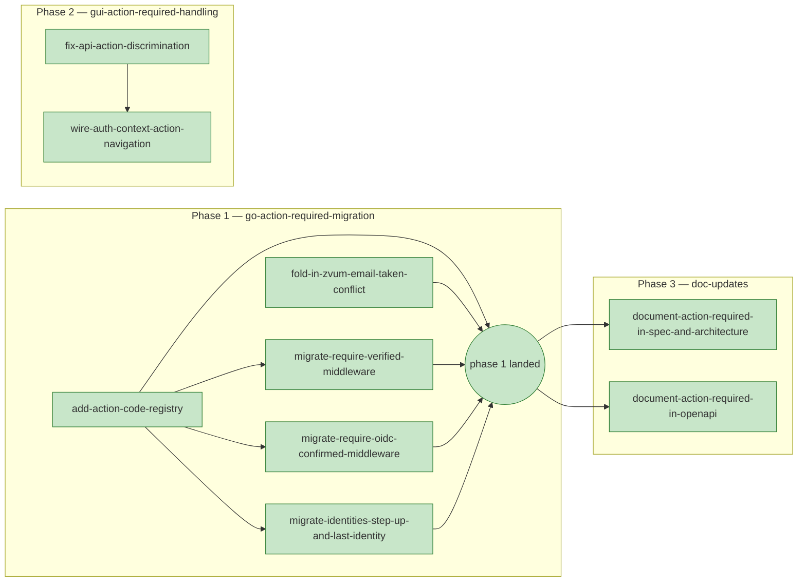
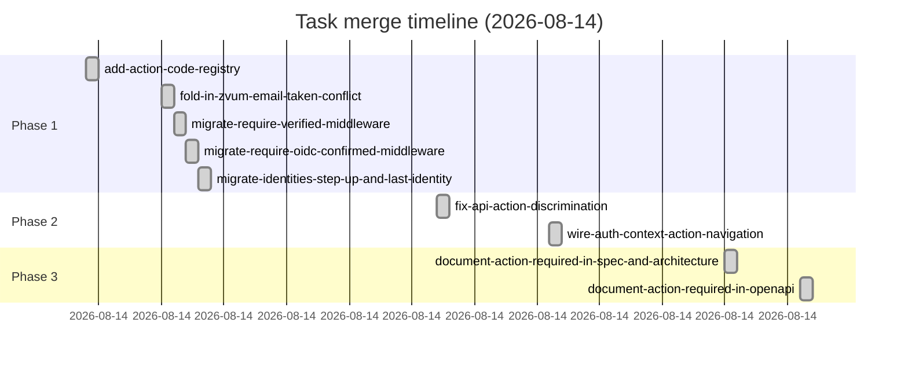

# Users Action-Required Migration — Summary

## Purpose and scope

This plan is Wave 1 (the final wave) of a 3-wave, 3-repo effort to adopt the "action-required"
response envelope defined by `docs/mf-standards/architecture/api-response-design.md`. Wave -1
(docs-mf-standards) designed the envelope; Wave 0 (mod-core) implemented the mechanisms
(`apiresp.WriteActionRequired`, `apiresp.ActionCode`, `apiresp.ActionBody`, `apiresp.Conflict`) in
`github.com/moduleforge/core-api/apiresp`. This plan migrated **mod-users** onto those mechanisms.

Concretely, the plan closed out five backend sites that had been deliberately deferred from an
earlier apiresp-migration plan because they emitted bespoke, non-standard flat JSON bodies
(`require_verified.go`'s internal-error and email-unverified branches, `require_confirmed.go`'s
OIDC-not-confirmed branch, and `identities.go`'s step-up-required and last-identity-error
helpers). It also folded in a previously-recorded follow-up (`ZVum`) that collapsed a bespoke
`email_taken` conflict-response construction into the shared `apiresp.Conflict(...)` mechanism,
fixed a latent error/action-discrimination bug in the GUI's HTTP client, wired the GUI's auth
context to navigate (rather than error-banner) on an action-required response, and brought the
prose spec/architecture docs and the OpenAPI schema up to date with the shipped shapes. Wiring the
consuming apps (`app-mfdemo`/`app-mftodo`) to actually mount the `/verify-email` and `/step-up`
routes the new envelope points at is explicitly out of this plan's reach (separate repos) and is
flagged as a cross-repo coordination item for the manager.

## What was done

### Phase 1 — Go Backend Action-Required Migration (`go-action-required-migration`)

- [001-add-action-code-registry.md](./phase-01-go-action-required-migration/001-add-action-code-registry.md) — added the `api/internal/useraction` package declaring mod-users' three registered `apiresp.ActionCode` values (`EmailUnverified` 403, `StepUpRequired` 409, `OIDCNotConfirmed` 503).
- [002-fold-in-zvum-email-taken-conflict.md](./phase-01-go-action-required-migration/002-fold-in-zvum-email-taken-conflict.md) — closed out follow-up `ZVum` by moving the `users.email_taken` field detail onto the `ErrEmailTaken` sentinel via `apiresp.Conflict(...)` and collapsing `writeServiceError` to a plain pass-through, with wire output unchanged.
- [003-migrate-require-verified-middleware.md](./phase-01-go-action-required-migration/003-migrate-require-verified-middleware.md) — migrated both `RequireVerifiedEmail` response branches off the bespoke flat envelope, onto `apiresp.WriteError` (internal_error) and `apiresp.WriteActionRequired` (`users.email_unverified`, `/verify-email`).
- [004-migrate-require-oidc-confirmed-middleware.md](./phase-01-go-action-required-migration/004-migrate-require-oidc-confirmed-middleware.md) — migrated `RequireOIDCConfirmed`'s not-confirmed branch onto `apiresp.WriteActionRequired` (`users.oidc_not_confirmed`, 503 written verbatim, `/oidc-config`, `data.state`).
- [005-migrate-identities-step-up-and-last-identity.md](./phase-01-go-action-required-migration/005-migrate-identities-step-up-and-last-identity.md) — migrated `identities.go`'s `writeStepUpRequired` (action-required, `users.step_up_required`, `/step-up`) and `writeLastIdentityError` (conflict detail, `users.last_identity`) helpers, threading `*http.Request` through six call sites.

### Phase 2 — GUI Action-Required Client And Wiring (`gui-action-required-handling`)

- [001-fix-api-action-discrimination.md](./phase-02-gui-action-required-handling/001-fix-api-action-discrimination.md) — fixed `gui/src/lib/api.ts`'s `request()` to detect a top-level `action` member before classifying errors, adding a dedicated `ApiActionRequiredError` plus local `ApiAction`/`ApiActionResponse` wire types and a same-origin-relative guard on `action.path`.
- [002-wire-auth-context-action-navigation.md](./phase-02-gui-action-required-handling/002-wire-auth-context-action-navigation.md) — wired the three reachable `api.self.get()` call sites in `gui/src/lib/auth-context.tsx` to catch `ApiActionRequiredError` ahead of other error handling and navigate via `onNavigate` while keeping the session intact.

### Phase 3 — Documentation Updates (`doc-updates`)

- [001-document-action-required-in-spec-and-architecture.md](./phase-03-doc-updates/001-document-action-required-in-spec-and-architecture.md) — documented the action-required envelope and the two reserved-mechanism changes in `docs/mod-users-spec.md` and `docs/architecture.md`, cross-checked against the shipped Phase 1 code.
- [002-document-action-required-in-openapi.md](./phase-03-doc-updates/002-document-action-required-in-openapi.md) — added the `Action` envelope schema to `api/openapi.yaml` and wired the 403/503 action-required responses onto every endpoint the shipped middleware chain actually gates.

## Diagrams

<!--
Textual description: a left-to-right dependency graph with three subgraphs, one per phase.
Phase 1 (go-action-required-migration) has five tasks: add-action-code-registry is the
foundation task feeding migrate-require-verified-middleware, migrate-require-oidc-confirmed-middleware,
and migrate-identities-step-up-and-last-identity; fold-in-zvum-email-taken-conflict runs independently
in parallel with no dependency. All five Phase 1 tasks feed into a "phase 1 landed" barrier node, which
in turn feeds both Phase 3 tasks (document-action-required-in-spec-and-architecture and
document-action-required-in-openapi), since Phase 3 documents the shipped Phase 1 shapes. Phase 2's
fix-api-action-discrimination is parallel-eligible with all of Phase 1 (depends only on the finalized
design contract, not on shipped Go code) and feeds its own dependent task,
wire-auth-context-action-navigation. All nine task nodes are styled as completed (green).
-->

```mermaid
graph LR
  subgraph P1["Phase 1 — go-action-required-migration"]
    p1_1["add-action-code-registry"]:::done
    p1_2["fold-in-zvum-email-taken-conflict"]:::done
    p1_3["migrate-require-verified-middleware"]:::done
    p1_4["migrate-require-oidc-confirmed-middleware"]:::done
    p1_5["migrate-identities-step-up-and-last-identity"]:::done
    p1_done(("phase 1 landed")):::done
  end
  subgraph P2["Phase 2 — gui-action-required-handling"]
    p2_1["fix-api-action-discrimination"]:::done
    p2_2["wire-auth-context-action-navigation"]:::done
  end
  subgraph P3["Phase 3 — doc-updates"]
    p3_1["document-action-required-in-spec-and-architecture"]:::done
    p3_2["document-action-required-in-openapi"]:::done
  end

  p1_1 --> p1_3
  p1_1 --> p1_4
  p1_1 --> p1_5
  p1_1 --> p1_done
  p1_2 --> p1_done
  p1_3 --> p1_done
  p1_4 --> p1_done
  p1_5 --> p1_done
  p1_done --> p3_1
  p1_done --> p3_2
  p2_1 --> p2_2

  classDef done fill:#c8e6c9,stroke:#2e7d32,stroke-width:1px;
```

<!--
Textual description: a Gantt-style timeline of the nine merge commits, all landing on 2026-08-14
between 17:19 and 18:16 local time, in phase order: Phase 1's five tasks merge first in quick
succession (17:19-17:28), then Phase 2's two tasks (17:47, 17:56), then Phase 3's two tasks
(18:10, 18:16). Bars are nominal 1-minute markers denoting merge instants, not task duration.
-->

```mermaid
gantt
    dateFormat  YYYY-MM-DD HH:mm
    title Task merge timeline (2026-08-14)
    section Phase 1
    add-action-code-registry                          :done, t1, 2026-08-14 17:19, 1m
    fold-in-zvum-email-taken-conflict                 :done, t2, 2026-08-14 17:25, 1m
    migrate-require-verified-middleware               :done, t3, 2026-08-14 17:26, 1m
    migrate-require-oidc-confirmed-middleware         :done, t4, 2026-08-14 17:27, 1m
    migrate-identities-step-up-and-last-identity      :done, t5, 2026-08-14 17:28, 1m
    section Phase 2
    fix-api-action-discrimination                     :done, t6, 2026-08-14 17:47, 1m
    wire-auth-context-action-navigation                :done, t7, 2026-08-14 17:56, 1m
    section Phase 3
    document-action-required-in-spec-and-architecture :done, t8, 2026-08-14 18:10, 1m
    document-action-required-in-openapi                :done, t9, 2026-08-14 18:16, 1m
```

*(Decision: the phase-1-landed dependency is drawn as a single barrier node feeding both Phase 3
tasks rather than ten individual cross-phase edges, to keep the diagram legible — every Phase 3
task genuinely depends on the whole of Phase 1 having landed, not on any one task's output
specifically.)*

## Git landmarks

| Task | Branch | Commit | Merge |
|---|---|---|---|
| 001-add-action-code-registry | plan/users-action-required-migration-01-001 | 4e6528b | 3a19082 |
| 002-fold-in-zvum-email-taken-conflict | plan/users-action-required-migration-01-002 | 23347ed | a2d54d0 |
| 003-migrate-require-verified-middleware | plan/users-action-required-migration-01-003 | 19c171b | a72a545 |
| 004-migrate-require-oidc-confirmed-middleware | plan/users-action-required-migration-01-004 | b34db4b | 1eb1b2a |
| 005-migrate-identities-step-up-and-last-identity | plan/users-action-required-migration-01-005 | be2ac56 | 69a0830 |
| 001-fix-api-action-discrimination | plan/users-action-required-migration-02-001 | e2c7d9f | 33db32d |
| 002-wire-auth-context-action-navigation | plan/users-action-required-migration-02-002 | 33d0189 | 132551b |
| 001-document-action-required-in-spec-and-architecture | plan/users-action-required-migration-03-001 | eb86f98 | ae7f335 |
| 002-document-action-required-in-openapi | plan/users-action-required-migration-03-002 | 77bf5d0 | 3ce4c5c |

## Follow-ups

From `plan/followups.yaml`:

- **`eiF8`** — "5 flat-envelope sites deferred" (2026-07-14). This is the follow-up this plan was
  created to resolve: all five deferred sites (`require_verified.go`, `require_confirmed.go`,
  `identities.go`'s two helpers) are now migrated onto the action-required/conflict envelopes.
  **Effectively resolved by this plan**, though the entry itself has not been removed from
  `followups.yaml` — recommend the manager close it out explicitly.
- **`biJk`** — "api/openapi.yaml missing identities surface" (2026-07-20). Still open. The
  `document-action-required-in-openapi` task confirmed the gap remains (the `/v1/self/identities`
  and `/v1/self/credential/*` surface is still entirely undocumented in `api/openapi.yaml`) and
  made the new `Action` schema's `code` enum ready for when those endpoints are added, but did not
  add the endpoints themselves (out of scope).
- **`UaNK`** — "go.work workaround ... doubly-nested worktree" (2026-07-20). Still open/informational.
  Reconfirmed by two Phase 1 tasks with an empirically different depth figure ("four" `../`, not
  "five") than the follow-up currently records — flagged for reconciliation. A later Phase 1 task
  (003) and both Phase 1 fold-in/002 tasks found the workaround unnecessary in their worktrees at
  all, suggesting the build environment may have since changed; worth re-verifying before acting on
  this follow-up's exact numbers.
- **`5RbD`** — "Pre-existing flaky test TestNewStepUpConsumedCache_JanitorStopsOnCancel" (2026-07-20).
  Still open. Reproduced again by two tasks in this plan (002, 005) as a pre-existing, unrelated,
  goroutine-count timing flake — not touched or fixed by this plan.
- **`le59`** and **`JFnc`** — pre-existing tooling/build follow-ups (Flow's git-add sweep not being
  yalc-aware; `mod-core/gui`'s missing `dist/index.css`) from an earlier plan. Not touched by this
  plan; left open as recorded.

Not yet recorded in `plan/followups.yaml` (task agents in this plan lacked a `followups_add`/
`add-followup` MCP tool and could not record these themselves — carried forward here for the
manager to add):

- `ApiAction`/`ApiActionResponse`/`ApiActionRequiredError` in `gui/src/lib/api.ts` are strong
  candidates for future promotion to `@moduleforge/core-gui`, parallel to how `ApiError`/
  `ApiErrorResponse`/`ApiRequestError` were promoted (raised by task
  `001-fix-api-action-discrimination`, its own Requirement 7).
- `users.step_up_required` has no reachable GUI call site in `mod-users` today — no
  identities-management UI exists to trigger it — so its action-required handling is presently
  limited to the generic `request()`-level throw with no navigation wiring in
  `gui/src/lib/auth-context.tsx` / `gui/src/lib/api.ts` (raised by task
  `002-wire-auth-context-action-navigation`, its own Requirement 5).
- `biJk`'s note should be extended: when the identities/credential endpoints are eventually added
  to `api/openapi.yaml`, their `409` `step_up_required` (action-required) and `409` `last_identity`
  (conflict + detail) responses must be documented using the `Action`/`Error` schemas this plan
  added (raised by task `002-document-action-required-in-openapi`).

Also flagged for the manager, outside `followups.yaml`'s scope:

- Requiring the consuming apps (`app-mfdemo`/`app-mftodo`) to mount the `/verify-email` and
  `/step-up` routes the new envelope now points at is a cross-repo coordination item, out of this
  plan's reach.
- All five Phase 1 task documents were marked `architectural_impact: true` by analogy with an
  earlier plan's precedent, not dictated verbatim by the phase file — whether a full phase-review
  gate was actually intended was flagged for manager confirmation in `plan/overview.md` and was
  never resolved during execution.
- `document-action-required-in-openapi` found the task doc's own worked example ("e.g. `GET
  /v1/self`, which can surface both [403 and 503]") was inaccurate — tracing the real middleware
  chain showed `GET /v1/self` can only ever return the 503 shape; only `PUT /v1/self` can surface
  both. The task corrected this in the shipped OpenAPI wiring, but the discrepancy is worth the
  manager's awareness.
